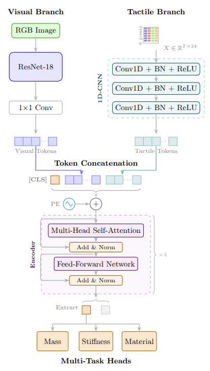

# Visuotactile Fusion for Robotic Object Property Estimation

A multi-modal deep learning framework that combines **visual** and **tactile** sensing for estimating physical properties of grasped objects using a low-cost robotic manipulator.

## Overview

This project implements a **ResNet-Transformer fusion architecture** that predicts three physical properties from a single grasp interaction:

| Property | Classes | Description |
|----------|---------|-------------|
| **Mass** | 4 | very_low, low, medium, high |
| **Stiffness** | 4 | very_soft, soft, medium, rigid |
| **Material** | 5 | sponge, foam, wood, hollow_container, filled_container |

### Key Features

- **Visual-Tactile Fusion**: Combines RGB images with proprioceptive signals (motor current, position, load, velocity)
- **Low-Cost Tactile Sensing**: Uses servo motor feedback as implicit tactile signals — no expensive tactile sensors required
- **Cross-Modal Conflict Handling**: Designed to overcome visual "simplicity bias" through tactile grounding

## Architecture



*The fusion model combines visual features (ResNet18) and tactile features (1D-CNN) through a Transformer encoder, outputting predictions for mass, stiffness, and material.*

## Project Structure

```
visuotactile/
├── scripts/                    # Training & utility scripts
│   ├── train_fusion.py         # Main training/evaluation entrypoint
│   ├── clean_dataset_ui.py     # Streamlit dataset cleaner
│   ├── find_defaultSetting.py  # Runtime/default setting helper
│   ├── visualize_rrc.py        # Plot helper
│   └── visualize_plaintext_dataset.py
│
├── outputs/                    # Model checkpoints & results
│   ├── fusion_model/           # Fusion model weights
│   ├── tactile_transformer/    # Tactile-only baseline
│   └── visual_resnet/          # Visual-only baseline
│
├── collect_custom_multimodal.py    # Data collection script
├── interactive_control_oop.py      # Robot teleoperation
├── replay_position_logs.py         # Motion replay utility
│
├── assets/                     # SO-101 robot CAD files
├── docs/                       # Documentation
└── so101_new_calib.urdf        # Robot URDF model
```

## Quick Start

### Prerequisites

```bash
# Python 3.10+
pip install torch torchvision
pip install opencv-python pillow numpy pandas
pip install scikit-learn seaborn matplotlib
pip install streamlit  # for dataset cleaner UI
```

### Training

```bash
# Train fusion model (full modalities)
python scripts/train_fusion.py --mode train \
    --data_root /home/martina/Y3_Project/Plaintextdataset \
    --epochs 50 --device cuda

# Ablation-style training (block one modality)
python scripts/train_fusion.py --mode train \
    --data_root /home/martina/Y3_Project/Plaintextdataset \
    --block_modality visual   # or tactile / none

# Evaluate saved checkpoint on a split
python scripts/train_fusion.py --mode eval \
    --data_root /home/martina/Y3_Project/Plaintextdataset \
    --checkpoint outputs/fusion_model_clean/best_model.pth \
    --eval_split test
```

### Data Collection

```bash
# Collect multimodal grasping data
python collect_custom_multimodal.py \
    --log-file outputs/logs/position_logs.json \
    --dataset-root ../Plaintextdataset/train
```

### Dataset Cleaning

```bash
# Launch Streamlit UI for dataset inspection
streamlit run scripts/clean_dataset_ui.py
```

## Dataset Format

```
Plaintextdataset/
├── train/
│   ├── physical_properties.json    # Labels for training objects
│   ├── WoodBlock_Native/
│   │   ├── episode_xxx/
│   │   │   ├── visual_anchor.jpg   # RGB image before grasp
│   │   │   ├── tactile_data.pkl    # Time-series sensor data
│   │   │   └── metadata.json       # Episode metadata
│   │   └── ...
│   └── ...
└── val/
    ├── physical_properties.json    # Labels for validation objects
    └── ...
```

### Tactile Data Channels (24-dim)

| Channel | Description |
|---------|-------------|
| 0-5 | Joint positions (6 DOF) |
| 6-11 | Joint loads |
| 12-17 | Joint currents |
| 18-23 | Joint velocities |

## Results

### Fusion Model Performance (Validation Set)

| Task | Accuracy | Weighted F1 |
|------|----------|-------------|
| Mass | 83.33% | 81.25% |
| Stiffness | 83.33% | 80.36% |
| Material | 75.83% | 68.47% |
| **Average** | **80.83%** | **76.69%** |

## Hardware

- **Robot**: SO-101 6-DOF Manipulator
- **Actuators**: Feetech STS3215 servo motors
- **Camera**: USB webcam (640×480)
- **Controller**: Raspberry Pi / Linux PC


## License

This project is for academic research purposes.
