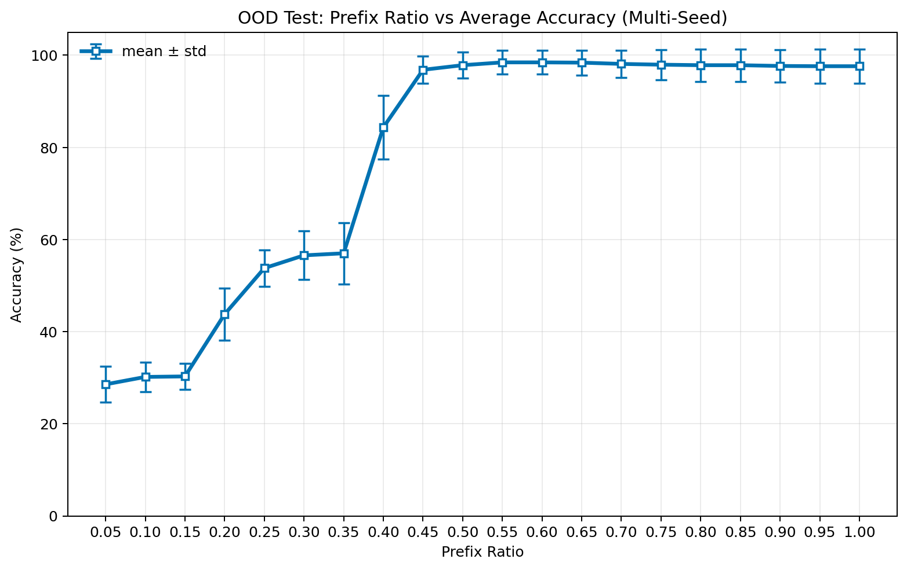
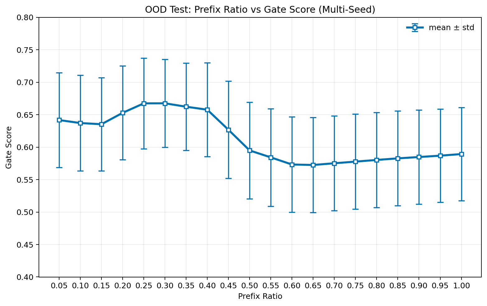
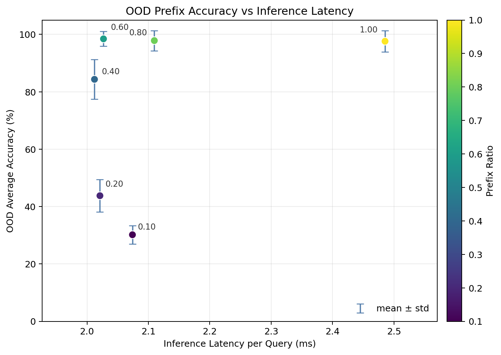

# `fusion_gating_online_v2` 模型与最新 OOD 结果分析

本文档基于 `2026-03-28` 的最新重评估结果更新，更新背景是：

- `Plaintextdataset/ood_test` 新增了 `hollowCardbox_noise`
- 仅重跑了 `ood_test`
- 旧的 `eval_ood_test` 与 `online_eval_ood_test` 结果已被覆盖

本次实际重跑的模型族只有 4 个：

- `vision-only`
- `tactile-only`
- `standard fusion`
- `fusion_gating_online_v2`

其中，本文重点分析对象仍然是：

- 脚本：`visuotactile/scripts/train_fusion_gating_online.py`
- 输出目录：`visuotactile/outputs/fusion_gating_online_v2_multiseed`

本次更新主要使用的结果文件：

- `visuotactile/outputs/fusion_gating_online_v2_multiseed/*/eval_ood_test/evaluation_results.json`
- `visuotactile/outputs/fusion_gating_online_v2_multiseed/*/online_eval_ood_test/online_evaluation_results.json`

说明：

- `test`、`val` 没有重跑，因此本文不再把旧的 ID 数字与新的 OOD 数字混写成同一结论。
- `block_visual` / `block_tactile` 的旧诊断结果这次也没有刷新，因此不再作为“最新结果”引用。

---

## 1. 版本定位

`fusion_gating_online_v2` 不是全新的主干，而是：

> `train_fusion_gating2.py` 中门控融合模型的前缀在线训练版

它的核心目标是：

1. 保留视觉-触觉门控融合结构；
2. 训练时随机截断触觉前缀；
3. 测试时显式评估 `10% / 20% / 40% / 60% / 80% / 100%` 前缀；
4. 让模型在抓取尚未结束时就能做出判断。

因此，这一版“在线”的准确含义是：

- 功能上支持在线预测；
- 实现上仍然是“拿当前整段前缀重新前向一次”；
- 它不是严格的增量缓存式 streaming model。

---

## 2. 模型结构

### 2.1 视觉分支

- Backbone：ImageNet 预训练 `ResNet18`
- 投影：`1x1 Conv2d(512 -> 256)`
- 输出：`49` 个视觉 token
- 冻结策略：`freeze_visual=True`

### 2.2 触觉分支

- 输入：`24` 通道触觉时间序列
- 编码器：3 层 `Conv1d + BatchNorm1d + ReLU`
- 每层 `stride=2`
- 作用：把原始触觉序列压缩成触觉 token 序列

### 2.3 门控融合

门控部分复用 `train_fusion_gating2.py`：

- 从视觉全局摘要 `v_global` 和触觉全局摘要 `t_global` 估计门控分数 `g`
- 用 `g` 缩放视觉 token
- 当 `g` 较低时，视觉 token 会被更强地抑制，并朝可学习先验 `t_null` 回退

所以 `g` 的含义不是“最终决策分给视觉多少权重”，而是：

- 对视觉 token 的连续抑制强度

### 2.4 融合主干

- 序列形式：`[CLS] + gated visual tokens + tactile tokens`
- 主干：4 层 Transformer Encoder
- 输出：从 `[CLS]` token 读取 `mass / stiffness / material` 三个任务的分类结果

### 2.5 辅助头

模型保留了 3 个触觉辅助头：

- `aux_mass`
- `aux_stiffness`
- `aux_material`

它们的作用是约束模型不能只靠视觉 shortcut。

---

## 3. 训练配置

当前 `fusion_gating_online_v2` checkpoint 的核心配置保持不变：

| 参数 | 值 |
| --- | --- |
| `epochs` | `60` |
| `batch_size` | `32` |
| `lr` | `1e-4` |
| `weight_decay` | `0.01` |
| `warmup_epochs` | `5` |
| `fusion_dim` | `256` |
| `num_heads` | `8` |
| `num_layers` | `4` |
| `dropout` | `0.1` |
| `freeze_visual` | `True` |
| `visual_drop_prob` | `0.1` |
| `tactile_drop_prob` | `0.0` |
| `lambda_reg` | `0.1` |
| `lambda_aux` | `0.5` |
| `reg_type` | `entropy` |
| `gate_reg_warmup_epochs` | `5` |
| `gate_reg_ramp_epochs` | `10` |
| `online_train_prob` | `0.6` |
| `online_min_prefix_ratio` | `0.4` |
| `min_prefix_len` | `64` |

这组参数意味着：

- 只有一部分样本会做前缀训练；
- 被截断样本的最短前缀通常仍在 `40%` 左右；
- 因此模型天然更擅长“中段后快速收敛”，而不是“极早期一触即知”。

---

## 4. 本次刷新范围

本次文档更新只使用最新 OOD 重跑结果。

已刷新：

- `fusion_gating_online_v2` 的 `eval_ood_test`
- `fusion_gating_online_v2` 的 `online_eval_ood_test`
- `vision-only` / `tactile-only` / `standard fusion` 的 `eval_ood_test`

未刷新：

- `test`
- `val`
- `block_visual`
- `block_tactile`

因此，下面所有“最新数字”都指向加入 `hollowCardbox_noise` 后的 OOD 集。

---

## 5. `fusion_gating_online_v2` 最新 OOD 总览

### 5.1 五个 seed 的最新 OOD 结果

| Seed | Mass | Stiffness | Material | Avg Acc | Avg Gate |
| --- | ---: | ---: | ---: | ---: | ---: |
| `123` | `100.00%` | `99.17%` | `100.00%` | `99.72%` | `0.5706` |
| `2024` | `100.00%` | `80.00%` | `90.83%` | `90.28%` | `0.5821` |
| `42` | `100.00%` | `98.33%` | `99.17%` | `99.17%` | `0.6502` |
| `456` | `100.00%` | `100.00%` | `99.17%` | `99.72%` | `0.4693` |
| `789` | `100.00%` | `98.33%` | `99.17%` | `99.17%` | `0.6740` |
| `mean ± std` | `100.00 ± 0.00%` | `95.17 ± 7.61%` | `97.67 ± 3.43%` | `97.61 ± 3.68%` | `0.589 ± 0.072` |

### 5.2 结果解读

这组新结果和旧趋势一致，但现在结论更稳：

- `mass` 已经稳定到所有 seed 都是 `100%`
- `material` 仍然非常强，平均 `97.67%`
- 主要波动来源仍是 `stiffness`
- `seed2024` 是明显的 OOD 弱点 seed，它把整体均值从接近满分拉低到了 `97.61%`

换句话说，加入 `hollowCardbox_noise` 后，`fusion_gating_online_v2` 依然是当前最强的 OOD 方案之一，而且并没有因为新增类别而整体失稳。

---

## 6. 与其他模型的最新 OOD 对比

为了判断新 OOD 类别是否改变模型排序，本次同时重跑了 4 个模型族。

### 6.1 OOD 平均准确率均值对比

| 模型 | 5-seed OOD Avg Acc Mean |
| --- | ---: |
| `vision-only` | `18.00%` |
| `tactile-only` | `88.83%` |
| `standard fusion` | `89.94%` |
| `fusion_gating_online_v2` | `97.61%` |

### 6.2 结论

这个排序非常清楚：

1. `fusion_gating_online_v2` 最强
2. `standard fusion` 和 `tactile-only` 接近，但明显低一个档位
3. `vision-only` 在新 OOD 上依旧几乎崩溃

更具体地说：

- `fusion_gating_online_v2` 比 `standard fusion` 高 `7.67` 个百分点
- `fusion_gating_online_v2` 比 `tactile-only` 高 `8.78` 个百分点
- `vision-only` 只有 `18%`，说明新 OOD 类别继续强化了“视觉 shortcut 不可靠”这一结论

这意味着 `fusion_gating_online_v2` 的优势不是“ID 上更会记住训练集”，而是：

- 在新增 OOD 类别后，依然能保持高泛化
- 而且明显优于普通 fusion

---

## 7. 在线前缀曲线

### 7.1 最新多 seed OOD 前缀均值

下表是 `fusion_gating_online_v2` 在 `ood_test` 上、5 个 seed 的在线前缀平均结果：

| Prefix Ratio | Mass | Stiffness | Material | Avg Acc | Avg Gate | Avg Acc Std |
| --- | ---: | ---: | ---: | ---: | ---: | ---: |
| `0.1` | `36.67%` | `29.83%` | `24.00%` | `30.17%` | `0.6370` | `3.20%` |
| `0.2` | `52.00%` | `40.33%` | `39.00%` | `43.78%` | `0.6527` | `5.71%` |
| `0.4` | `88.00%` | `84.17%` | `80.83%` | `84.33%` | `0.6576` | `6.86%` |
| `0.6` | `100.00%` | `96.50%` | `98.83%` | `98.44%` | `0.5731` | `2.56%` |
| `0.8` | `100.00%` | `95.33%` | `98.17%` | `97.83%` | `0.5802` | `3.51%` |
| `1.0` | `100.00%` | `95.17%` | `97.67%` | `97.61%` | `0.5892` | `3.68%` |

### 7.2 曲线含义

这条曲线仍然体现出非常典型的“中段收敛”：

- `10%-20%` 前缀时仍然偏弱
- 到 `40%` 时已经进入可用区间，平均 `84.33%`
- 到 `60%` 时基本完成决策，平均 `98.44%`
- `80%-100%` 区间进入稳定平台

这说明模型当前最适合的部署节奏仍是：

- `40%` 左右做第一次可用预测
- `60%` 左右做高置信确认

### 7.3 为什么早期还不够强

根因没有变化，还是训练分布决定的：

- `online_train_prob = 0.6`
- `online_min_prefix_ratio = 0.4`
- `min_prefix_len = 64`

这意味着模型在训练时几乎不会系统性暴露在 `10%-20%` 的极短前缀上，所以：

- `0.1` 和 `0.2` 的性能偏低不是偶然
- 而是训练目标本来就更偏向“中段后尽快稳定”

如果以后要强化“极早期响应”，最直接的做法还是：

1. 把 `online_min_prefix_ratio` 从 `0.4` 下调到 `0.1` 或 `0.2`
2. 让前缀采样分布显式偏向短前缀

---

## 8. Gate 行为变化

最新多 seed 曲线里，`gate_score` 的趋势也很稳定：

- `0.1-0.4` 前缀时，平均 gate 在 `0.637-0.658`
- `0.6-1.0` 前缀时，平均 gate 回落到 `0.573-0.589`

这说明模型在新增 OOD 类别后仍保持同样的模态使用逻辑：

- 早期触觉不够充分时，更依赖视觉辅助
- 触觉逐步变强后，视觉依赖下降
- 最终决策仍是明显的“触觉主导”

这个现象和 `vision-only = 18%`、`tactile-only = 88.83%`、`fusion_gating_online_v2 = 97.61%` 是一致的。

---

## 9. 任务层面分析

### 9.1 `mass`

最新 OOD 多 seed 结果：

- `mean = 100.00%`
- `std = 0.00%`

这是当前最稳的任务，已经可以视为稳定解决。

### 9.2 `stiffness`

最新 OOD 多 seed 结果：

- `mean = 95.17%`
- `std = 7.61%`

这仍然是最不稳定的任务，也是当前主要波动来源。

更准确地说：

- 模型不是整体崩，而是个别 seed 会在硬度上掉点
- 当前新增的 `hollowCardbox_noise` 没有改变这个问题的性质，只是继续暴露了 `stiffness` 对 seed 更敏感

### 9.3 `material`

最新 OOD 多 seed 结果：

- `mean = 97.67%`
- `std = 3.43%`

材料任务整体依然非常强，而且明显比 `stiffness` 更稳定。

---

## 10. 这次更新后的综合判断

加入 `hollowCardbox_noise` 后，新的 OOD 结果给出的结论比旧文档更清楚：

1. `fusion_gating_online_v2` 依然是当前最强 OOD 模型
2. 它的优势在新 OOD 类别加入后没有消失，反而更容易和普通 fusion 拉开差距
3. 模型排序依旧是：
   `fusion_gating_online_v2 > standard fusion ≈ tactile-only >> vision-only`
4. 门控行为仍然健康，没有塌成视觉常开
5. 在线前缀性能依旧体现“40% 可用，60% 接近收敛”

因此，如果当前项目目标是：

- 在抓取中途尽早做决策
- 同时保持高 OOD 泛化能力

那么 `fusion_gating_online_v2` 仍然可以视为当前最实用的在线部署基线。

---

## 11. 仍然存在的限制

它的主要限制没有变：

1. 不是严格 streaming / causal model
2. 新前缀到来时仍需整段重算
3. `10%-20%` 极短前缀表现仍弱
4. `stiffness` 任务仍是 OOD 波动主来源

所以如果后续目标改成：

- 极短接触就立即判断
- 高频实时更新

那么需要的不是简单复用当前配置，而是专门为短前缀训练再做一版 early-response 模型。

---

## 12. 附图

### 12.1 前缀-准确率多种子曲线

### 12.2 前缀-gate score 多种子曲线

### 12.3 准确率-延迟 trade-off

